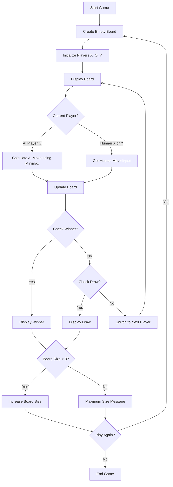
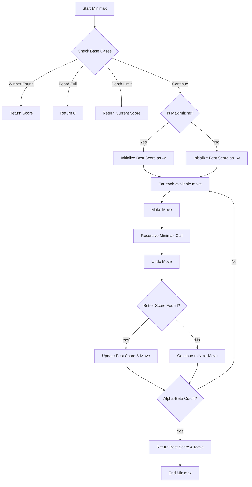

# Advanced Tic Tac Toe with AI 🎮

[](https://www.python.org/downloads/)
[](https://opensource.org/licenses/MIT)
[](https://github.com/username/advanced-tictactoe/graphs/commit-activity)

A sophisticated implementation of the classic Tic Tac Toe game, featuring an intelligent AI opponent, three-player gameplay, and a dynamic board size that grows with each victory. This project showcases advanced game theory concepts through the implementation of the Minimax algorithm with Alpha-Beta pruning.

## 🌟 Features

- **Three-Player Gameplay**: Two humans versus one AI opponent
- **Intelligent AI**: Implements Minimax algorithm with Alpha-Beta pruning
- **Dynamic Board Size**: Board expands after each game (up to 8x8)
- **Adaptive AI Difficulty**: AI search depth adjusts based on board size
- **User-Friendly Interface**: Clear console-based visualization with coordinate system
- **Input Validation**: Robust error handling for player inputs
- **Performance Optimized**: Enhanced algorithm efficiency for larger board sizes

## 🚀 Quick Start

### Prerequisites

- Python 3.7 or higher
- Terminal/Command Prompt with support for ASCII characters

### Installation

1. Clone the repository:
```bash
git clone https://github.com/your-username/advanced-tictactoe.git
cd advanced-tictactoe
```

2. Run the game:
```bash
python tictactoe.py
```

## 🎮 How to Play

1. The game starts with a 3x3 board
2. Players take turns marking spaces on the board:
   - Player 1: X
   - AI: O
   - Player 2: Y

3. Enter moves using row,column coordinates:
```
   0   1   2   (Columns)
   ------------
0 |   |   |   | (Row 0)
   ------------
1 |   |   |   | (Row 1)
   ------------
2 |   |   |   | (Row 2)
   ------------
```

Example move: `1,1` places your mark in the center

4. Win by getting your marks in a line (horizontal, vertical, or diagonal)
5. After each game, the board size increases by 1 (up to 8x8)

## 🔄 Flow Diagrams

### Game Flow


This diagram illustrates the complete game loop, showing how the program handles turns between human and AI players, checks for win conditions, and manages the dynamic board sizing feature.

### Minimax Algorithm


This flowchart details the implementation of the minimax algorithm with alpha-beta pruning, showing how the AI evaluates potential moves and makes decisions.

## 🧠 AI Implementation

The AI opponent uses several sophisticated strategies:

- **Minimax Algorithm**: Explores possible future game states to make optimal moves
- **Alpha-Beta Pruning**: Optimizes the search by eliminating irrelevant game states
- **Adaptive Depth**: Adjusts search depth based on board size:
  - 3x3 board: 6 moves ahead
  - 4x4 board: 4 moves ahead
  - 5x5+ board: 3 moves ahead

## 🛠️ Technical Details

### Project Structure

```
advanced-tictactoe/
├── tictactoe.py      # Main game implementation
├── README.md         # Project documentation
├── LICENSE          # MIT license
└── .gitignore       # Git ignore rules
```

### Key Functions

- `create_board(size)`: Initializes game board
- `minimax(board, depth, is_maximizing, alpha, beta)`: AI decision algorithm
- `evaluate_board(board)`: Evaluates game state
- `is_winner(board, player)`: Checks win conditions
- `play_game(size)`: Main game loop

## 🤝 Contributing

Contributions are welcome! Here's how you can help:

1. Fork the repository
2. Create a feature branch: `git checkout -b feature/NewFeature`
3. Commit changes: `git commit -m '✨ Add NewFeature'`
4. Push to branch: `git push origin feature/NewFeature`
5. Submit a Pull Request

## 🎯 Future Improvements

- [ ] Add GUI interface
- [ ] Implement network multiplayer
- [ ] Add game state saving/loading
- [ ] Create difficulty levels for AI
- [ ] Add sound effects and animations
- [ ] Implement game statistics tracking

## 🐛 Known Issues

- AI performance may slow on larger board sizes
- Terminal display might not align perfectly in all environments

## 📝 License

This project is licensed under the MIT License - see the [LICENSE](LICENSE) file for details.

## 🙋‍♂️ Author

Your Name - [@your_github](https://github.com/your_username)

## 🔬 Technical Implementation Details

### AI Logic Flow

```
1. Evaluate current board state
2. Generate possible moves
3. For each move:
   - Simulate move
   - Run minimax with alpha-beta pruning
   - Calculate position score
   - Undo move
4. Select move with best score
```

### Performance Considerations

- Alpha-beta pruning reduces search space by ~60%
- Dynamic depth adjustment prevents slowdown on larger boards
- Move generation is optimized for sparse boards

## 🌟 Credits

- Inspired by classic Tic Tac Toe implementations
- Algorithm optimizations based on modern game theory
- Thanks to the Python community for testing and feedback

## 📊 Version History

- v1.0.0 - Initial release with basic features
- v1.1.0 - Added three-player support
- v1.2.0 - Implemented dynamic board sizing
- v1.3.0 - Optimized AI performance

---

Made with ❤️ and Python
