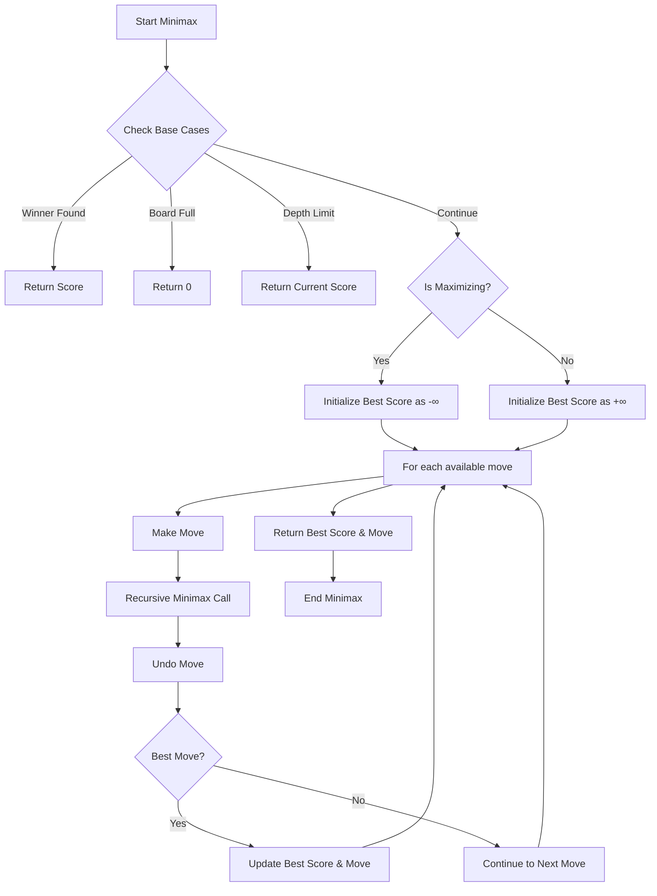

# Advanced Tic Tac Toe with AI 🎮

[](https://www.python.org/downloads/)
[](https://opensource.org/licenses/MIT)

A sophisticated Tic Tac Toe game featuring an intelligent AI opponent, three-player gameplay, and a dynamic board that grows with each victory.

## 🌟 Features

- **Three-Player Gameplay**: Two humans versus one AI opponent
- **Intelligent AI**: Implements Minimax algorithm for strategic moves
- **Dynamic Board Size**: Board expands after each game (up to 8x8)
- **Adaptive AI Difficulty**: AI search depth adjusts based on board size
- **User-Friendly Interface**: Clear console-based visualization
- **Robust Input Validation**

## 🚀 Quick Start

### Prerequisites

- Python 3.7+
- Terminal supporting ASCII characters

### Installation

1. Clone the repository:
```bash
git clone https://github.com/your-username/advanced-tictactoe.git
cd advanced-tictactoe
```

2. Run the game:
```bash
python tictactoe.py
```

## 🎮 How to Play

1. Start with a 3x3 board
2. Players take turns:
   - Player 1: X
   - AI: O
   - Player 2: Y

3. Enter moves using row,column coordinates:
```
   0   1   2   (Columns)
   ------------
0 |   |   |   | (Row 0)
   ------------
1 |   |   |   | (Row 1)
   ------------
2 |   |   |   | (Row 2)
   ------------
```

4. Win by creating a line (horizontal, vertical, or diagonal)
5. Board size increases after each game (up to 8x8)

## 🧠 AI Strategy: Minimax Algorithm

The AI uses the Minimax algorithm to make strategically optimal moves. Here's a detailed flow of the algorithm:



### Search Depth Strategy
- 3x3 board: 6 moves ahead
- 4x4 board: 4 moves ahead
- 5x5+ board: 3 moves ahead

## 🤝 Contributing

Contributions welcome! 

1. Fork the repository
2. Create a feature branch
3. Commit changes
4. Push to branch
5. Submit a Pull Request

## 🎯 Future Improvements

- [ ] GUI interface
- [ ] Network multiplayer
- [ ] Game state saving/loading
- [ ] Adjustable AI difficulty
- [ ] Game statistics tracking

## 📝 License

MIT License - see [LICENSE](LICENSE) file

## 🙋‍♂️ Contact

[Syed Faraz] - [@your_github](https://github.com/faraz18001)

---

Made with ❤️ and Python
